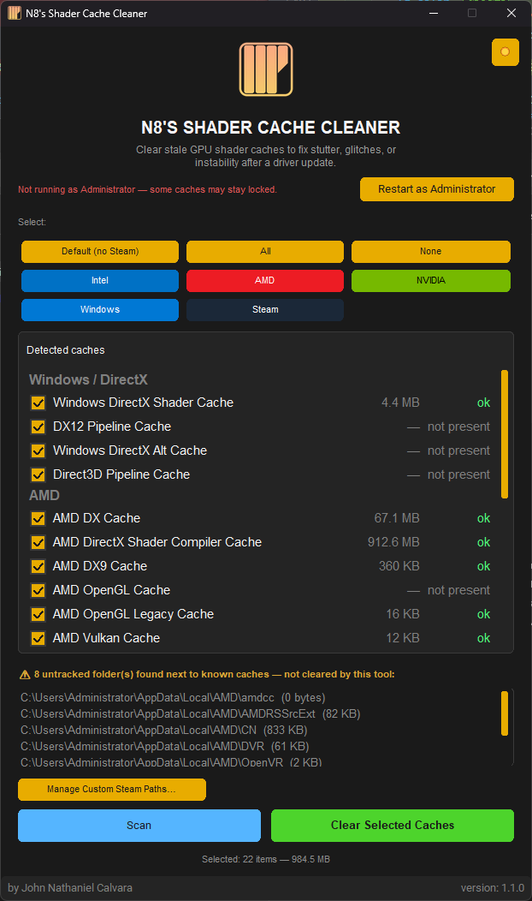
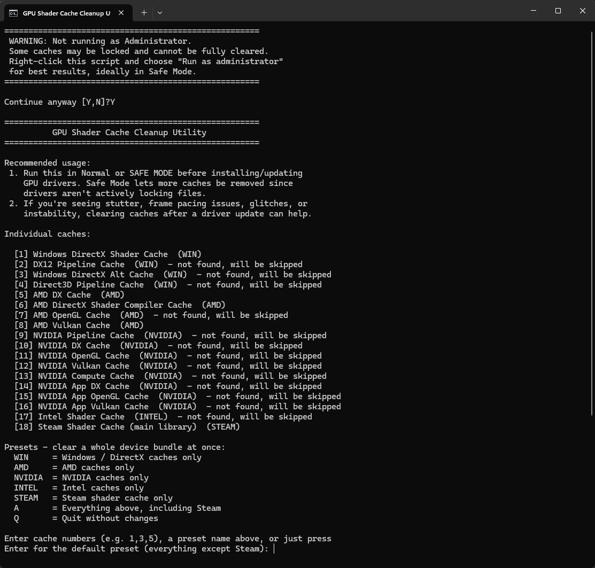

# N8's Shader Cache Cleaner

A Windows utility for clearing stale GPU shader caches and reclaiming disk space after driver updates, game installs, or graphics-related instability.

The project includes both a graphical app and a command-line batch utility for quick cleanup.

## Download

- [Windows Portable EXE](https://github.com/n8ventures/Windows-Shader-Cache-Cleaner/releases/latest/download/N8sShaderCacheCleaner.exe)
- [GitHub Releases](https://github.com/n8ventures/Windows-Shader-Cache-Cleaner/releases)

## What this tool cleans

It scans and can remove shader cache folders commonly created by:

- Windows / DirectX
- AMD
- NVIDIA
- Intel
- Steam

It targets known cache folders such as:

- `%LOCALAPPDATA%\D3DSCache`
- `%LOCALAPPDATA%\AMD\DXCache`
- `%LOCALAPPDATA%\NVIDIA\VkCache`
- `%LOCALAPPDATA%\Intel\ShaderCache`
- Steam library paths under `steamapps\shadercache`

## Why use it

Shader caches are meant to speed up game and app launch times, but stale or corrupted caches can sometimes cause:

- stutter
- visual glitches
- driver-related instability
- poor performance after updates

Clearing the cache is a common safe troubleshooting step and the app makes it easy to choose affected vendors without deleting unrelated files.

## Features

- Detects common GPU cache folders automatically
- Shows cache sizes before you delete anything
- Lets you select presets such as Windows, AMD, NVIDIA, Intel, Steam, or All
- Detects Steam library folders automatically
- Supports custom Steam shadercache paths
- Lists untracked vendor folders that were added by newer drivers
- Works from a GUI or a batch script
- Built for Windows 10/11

## Quick start

### GUI version

1. Install dependencies:

   ```powershell
   pip install customtkinter
   ```

2. Run the app:

   ```powershell
   python mainGUI.py
   ```

3. Choose a preset or manually select cache folders, then clear them.

> Running as Administrator is recommended so more cache folders can be removed without being locked by Windows.

### CLI version

Use the batch script directly:

```powershell
Clean_Shaders.bat /HELP
Clean_Shaders.bat /LIST
Clean_Shaders.bat /AMD
Clean_Shaders.bat /NVIDIA
Clean_Shaders.bat /DEFAULT
Clean_Shaders.bat /ALL
```

The CLI supports:

- `/LIST` — show detected caches and sizes
- `/WINDOWS` — clear Windows/DirectX caches only
- `/AMD` — clear AMD caches only
- `/NVIDIA` — clear NVIDIA caches only
- `/INTEL` — clear Intel caches only
- `/STEAM` — clear Steam shader cache only
- `/DEFAULT` — clear everything except Steam
- `/ALL` — clear all known caches, including Steam
- `/PRESET:x` — run a vendor preset
- `/ADDSTEAMPATH:path` — add a Steam shader cache path

## Example CLI usage

```powershell
# List cache folders without deleting anything
Clean_Shaders.bat /LIST

# Remove NVIDIA cache folders only
Clean_Shaders.bat /NVIDIA

# Remove all cache folders except Steam
Clean_Shaders.bat /DEFAULT

# Remove everything, including Steam
Clean_Shaders.bat /ALL
```

## Safety notes

- This tool deletes shader cache folders only; it does not remove game files, driver installations, or Windows system components.
- Some folders may be in use and cannot be deleted unless the app is run with elevated privileges.
- Clearing shader caches is generally safe and reversible, but if you are troubleshooting a major graphics issue, it is still wise to keep a backup or restore point.

## Repository layout

- `mainGUI.py` — the CustomTkinter GUI
- `modules/shader_cache_core.py` — cache discovery, sizing, and cleanup logic
- `modules/configModule.py` — app configuration storage
- `Clean_Shaders.bat` — command-line cleanup utility
- `devtools.py` — build helper for packaging
- `theme/` — app theme files
- `docs/` — screenshots and supporting assets

## Screenshots





## Development

This project is packaged for Windows using PyInstaller and the build helper in `devtools.py`.

To build locally:

```powershell
python devtools.py --dry
python devtools.py
```
